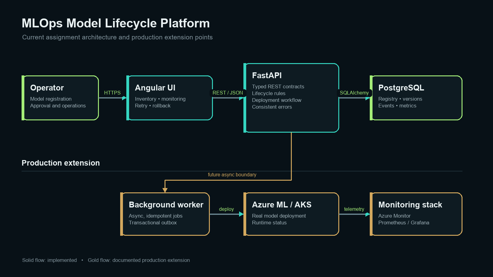
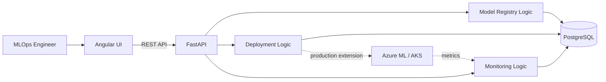

# Architecture

## Overview

This application is a small MLOps platform for managing a model after training. It covers model registration, versioning, approval, lifecycle promotion, deployment tracking, monitoring, retry and rollback.

## Main components

### Angular frontend
The frontend provides the operational view of the platform. It displays registered models and versions, deployment history and monitoring metrics. Retry and rollback actions are also available from the deployment view.

### FastAPI backend
FastAPI exposes REST endpoints and contains the application workflow. The API validates requests and delegates lifecycle/deployment rules to the service layer.

### PostgreSQL
PostgreSQL stores model metadata, versions, approval/lifecycle state, deployments, deployment events and monitoring metrics. SQLAlchemy is used for persistence and Alembic is included for schema migration.

## Model lifecycle

The lifecycle used in the assignment is:

`DRAFT → VALIDATED → APPROVED → STAGING → PRODUCTION → ARCHIVED`

Only allowed transitions are accepted. A version must also have `APPROVED` approval status before it can be deployed to production.

## Deployment workflow

A deployment starts as `REQUESTED`, moves through `VALIDATING` and `DEPLOYING`, and finishes as `SUCCEEDED` or `FAILED`. The assignment uses a simulated deployment adapter so the complete workflow can run locally without requiring a cloud account.

An idempotency key is stored with each deployment request. Repeating the same request returns the existing deployment instead of creating a duplicate. Failed deployments can be retried. Successful production deployments can be rolled back.

## Monitoring

The platform stores sample telemetry for latency, throughput, error rate, quality score, drift score and availability. The backend derives a simple `HEALTHY` or `DEGRADED` status from the latest metrics and the Angular UI displays the values.

## How I would extend it in a real Azure project

For a production implementation, the deployment service could submit a deployment to Azure ML or AKS instead of using the local simulator. A background worker would be preferable for long-running deployment jobs. Model artifacts could be stored in Azure ML/Blob Storage, container images in ACR, and operational metrics could be sent to Azure Monitor/Prometheus/Grafana. Authentication and role-based access would also be added before allowing approval or production deployment actions.
